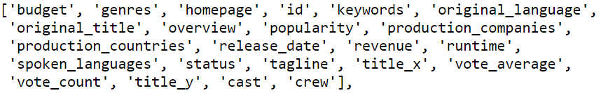
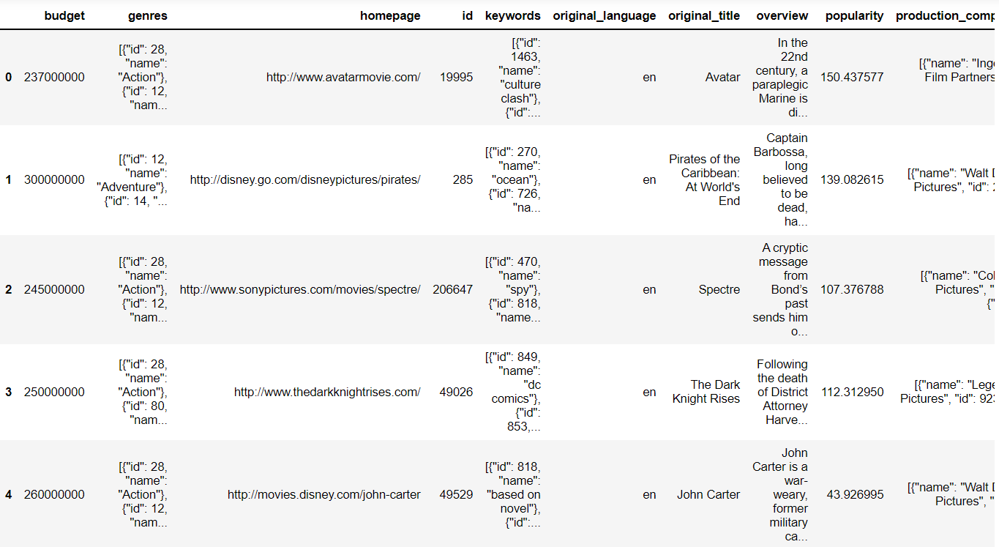

<!-- PROJECT TITLE -->
<h1 align="center">Movie Recommendation System</h1>

<!-- HEADER -->
<p align="center">
  
</p>

<!-- PROJECT DESCRIPTION -->
## <br>**➲ Project description**
Recommendation systems are among the most popular applications of data science.
They are used to predict the Rating or Preference that a user would give to an item.
Almost every major company has applied them in some form or the other, Amazon uses it
to suggest products to customers, YouTube uses it to decide which video to play next on auto play,
and Facebook uses it to recommend pages to like and people to follow.

<!-- PREREQUISTIES -->
## <br>**➲ Prerequisites**
This is list of required packages and modules for the project to be installed :
* <a href="https://www.python.org/downloads/" target="_blank">Python 3.x</a>
  <https://www.python.org/downloads>
* Pandas
* Numpy
* Scikit-learn

<!-- THE DATASET -->
## <br>**➲ The Dataset**
Human activites dataset contain about 4803 record with 23 features,<br>
like budget, geners, homepage and etc.<br>
<br>**Dataset features :**<br>
<br>
<br>**Dataset head :**<br>


<!-- CODING SECTIONS -->
## <br>**➲ Coding Sections**
In this part we will see the project code divided to sections as follows:
<br>

- Section 1 | Data Preprocessing :<br>
In this section we aim to do some operations on the dataset before training the model on it,
<br>processes like :
  - Load dataset
  - Merge both credits and movies dataset
  - Drop unnecessary columns<br><br>

- Section 2 | Model Creation :<br>
The dataset is ready for training, so we create a feature extraction model using scikit-learn and thin fit it to the data.<br>

- Section 3 | Give recommendations :<br>
Finally we use sigmoid kernel to make recommendation.

<!-- INSTALLATION -->
## <br>**➲ Installation**
1. Clone the repo
   ```sh
   git clone https://github.com/omaarelsherif/Movie-Recommendation-System-Using-Machine-Learning.git
   ```
2. Run the code from cmd
   ```sh
   python movie_recommendation_system.py "MOVIE_NAME"
   ```
   For example:
   ```sh
   python movie_recommendation_system.py Avatar
   ```
<!-- OUTPUT -->
## <br>**➲ Output**
Now let's see the project output after running the code to recommend movies related to **"Avatar"** movie:

**Credit dataset head :**<br>
<br><br>

**Movies dataset head :**<br>
<br><br>

**Merged dataset head :**<br>
<br><br>

**Cleaned dataset head :**<br>
<br><br>

**Sigmoid kernal :**<br>
<br><br>

**Recommendations results :**<br>
<br><br>

<!-- REFERENCES -->
## <br>**➲ References**
These links may help you to better understanding of the project idea and techniques used :
1. Recommendation system in machine learning : https://bit.ly/3Aa62nN
2. TfidfVectorizer : https://bit.ly/3nqkTqy
3. Model evaluation : https://bit.ly/3B12VOO

<!-- CONTACT -->
## <br>**➲ Contact**
- E-mail   : [omaarelsherif@gmail.com](mailto:omaarelsherif@gmail.com)
- LinkedIn : https://www.linkedin.com/in/omaarelsherif/
- Facebook : https://www.facebook.com/omaarelshereif
